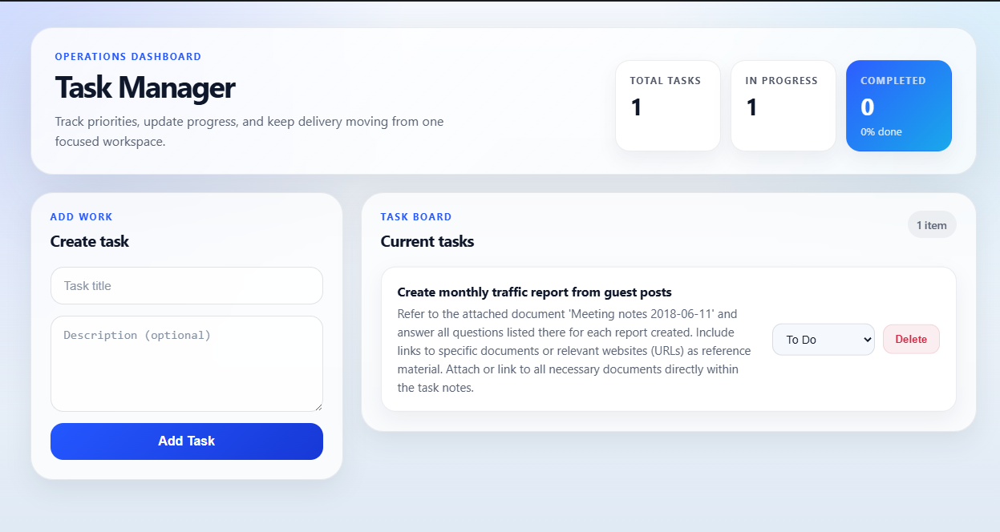

# Task Manager


A polished task management application built with React, Vite, Node.js, Express, and PostgreSQL. Manage tasks easily with create, update, and delete actions supported by a clean UI and REST API.

---

## ✨ Overview

This project demonstrates a well-structured full-stack task manager:

- React frontend with component-based UI
- Express backend exposing REST endpoints
- PostgreSQL database for task persistence
- Lightweight Vite development workflow

---

## 🧪 Live Preview



---

## 🚀 Features

- Create tasks with title and optional description
- Change task status: `To Do`, `In Progress`, `Done`
- Delete tasks safely with confirmation
- Real-time task list updates in the browser
- Clean frontend/backend separation

---

## 🧩 Tech Stack

| Layer | Technology |
| --- | --- |
| Frontend | React 19, Vite, JavaScript |
| Backend | Node.js, Express, PostgreSQL |
| Database | PostgreSQL |
| API | REST |

---

## 📁 Project Structure

```text
backend/
  ├─ db.js
  ├─ routes/
  │   └─ tasks.js
  ├─ schema.sql
  ├─ server.js
  └─ package.json
frontend/
  ├─ public/
  │   └─ screenshot.svg
  ├─ src/
  │   ├─ api/tasks.js
  │   ├─ components/
  │   │   ├─ TaskForm.jsx
  │   │   ├─ TaskItem.jsx
  │   │   └─ TaskList.jsx
  │   ├─ App.css
  │   ├─ App.jsx
  │   └─ main.jsx
  ├─ package.json
  └─ vite.config.js
README.md
```

---

## 🛠️ Setup Guide

### 1. Clone repository

```bash
git clone https://github.com/<your-username>/task-manager.git
cd task-manager
```

### 2. Backend setup

```bash
cd backend
npm install
```

Create `backend/.env`:

```env
DB_USER=your_db_user
DB_PASSWORD=your_db_password
DB_HOST=localhost
DB_PORT=5432
DB_NAME=your_database_name
PORT=5000
```

Create the PostgreSQL table:

```bash
psql -U your_db_user -d your_database_name -f schema.sql
```

Start the backend:

```bash
npm run dev
```

### 3. Frontend setup

In a separate terminal:

```bash
cd frontend
npm install
npm run dev
```

Open the app at:

```text
http://localhost:5175
```

---

## 🔌 API Reference

### Fetch tasks

- `GET /api/tasks`

### Create a task

- `POST /api/tasks`
- Request body:

```json
{
  "title": "Write README",
  "description": "Add a clear project README",
  "status": "To Do"
}
```

### Update task status

- `PATCH /api/tasks/:id`
- Request body:

```json
{
  "status": "In Progress"
}
```

### Delete a task

- `DELETE /api/tasks/:id`

---

## ✅ Notes

- `status` values: `To Do`, `In Progress`, `Done`
- `title` is required and max 150 characters
- `description` is optional
- Data is sorted by creation time in the backend

---

## 📌 Scripts

### Backend
- `npm run dev` — start backend with `nodemon`
- `npm start` — start backend with Node.js

### Frontend
- `npm run dev` — start Vite dev server
- `npm run build` — build production frontend
- `npm run preview` — preview production build

---

## 🤝 Contributing

Enhancements you can add:

- Task filtering and search
- Authentication and user sessions
- Task categories or due dates
- Deployment to cloud hosting

---

## 📄 License

This project is free to use and modify.
